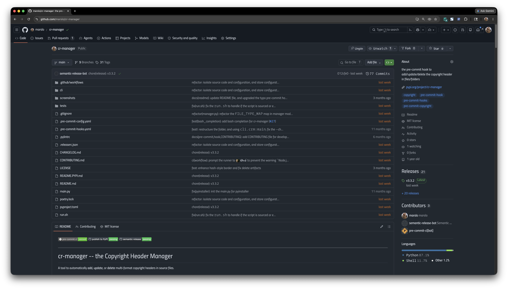

# github-optimized-layout

Optimized GitHub layout: 85vw centered width for readability, full-width for diffs and commits. Includes trailing whitespace highlighting for PR code review.



## Prerequisites

| EXTENSION                                                          | PURPOSE                                                                                                                                                                               |
|--------------------------------------------------------------------|---------------------------------------------------------------------------------------------------------------------------------------------------------------------------------------|
| [Refined GitHub](https://github.com/refined-github/refined-github) | GitHub UX enhancements. Enable **"Show whitespace"** in its settings — this style hides the markers on non-diff pages to reduce noise, and only shows them where they matter (diffs). |
| [Stylus](https://github.com/openstyles/stylus)                     | Injects the layout CSS. Must use **Instant inject mode** to prevent FOUC (see [below](#why-stylus-instead-of-refined-githubs-custom-css)).                                            |
| [Tampermonkey](https://www.tampermonkey.net/)                      | Runs the trailing whitespace highlighter userscript on PR diff pages.                                                                                                                 |

## Install

### 1. Stylus — Layout CSS

1. Install [Stylus](https://chrome.google.com/webstore/detail/stylus/clngdbkpkpeebahjckkjfobafhncgmne)
2. Open [`github-optimized-layout.user.css`](https://github.com/marslo/github-optimized-layout/raw/main/github-optimized-layout.user.css) — Stylus will prompt to install
3. In the Stylus install/edit page, set **Inject mode → Instant**

### 2. Tampermonkey — Trailing Whitespace Highlighter

Highlights trailing whitespace (spaces at end of line) with a red background in PR diffs — makes whitespace issues impossible to miss during code review.

**Option A — Import from script file:**

1. Install [Tampermonkey](https://www.tampermonkey.net/)
2. Open Tampermonkey Dashboard → Utilities tab → **Import from file**
3. Select [`tampermonkey/GitHub PR trailing whitespace highlighter.js`](tampermonkey/GitHub%20PR%20trailing%20whitespace%20highlighter.js)

**Option B — Import full backup:**

1. Open Tampermonkey Dashboard → Utilities tab → **Import from file**
2. Select [`tampermonkey/tampermonkey-backup-chrome.zip`](tampermonkey/tampermonkey-backup-chrome.zip)

### 3. Refined GitHub

1. Install [Refined GitHub](https://github.com/refined-github/refined-github)
2. Open its options and enable **"Show whitespace"**

> [!NOTE]
> Do NOT put the layout CSS in Refined GitHub's "Custom CSS" field — it causes FOUC. Use Stylus instead.

## Layout Behavior

| PAGE                                                     | WIDTH | WHY                               |
|----------------------------------------------------------|-------|-----------------------------------|
| Code / file browser                                      | 85vw  | Comfortable reading width         |
| Issues / PR list                                         | 85vw  | Same                              |
| Commit history                                           | 85vw  | Same                              |
| New Issue                                                | 85vw  | Constrained for readability       |
| Gist                                                     | 85vw  | Matches the rest of GitHub        |
| Profile (Overview / Repos / Projects / Packages / Stars) | 85vw  | Via `container-xl` constraint     |
| Commit detail                                            | 100%  | Diffs need horizontal space       |
| PR Files changed                                         | 100%  | Same                              |
| PR Checks                                                | 100%  | Diff viewer wraps the layout root |
| Actions / Security                                       | 100%  | Uses its own full-width layout    |

### Customization

Edit the two CSS variables in `:root` to adjust widths globally:

```css
:root {
  --gh-custom-width: min(85vw, 100%);   /* main content cap */
  --gh-min-width: 900px;                /* prevent too-narrow layouts */
}
```

## Why Stylus Instead of Refined GitHub's Custom CSS?

Refined GitHub supports custom CSS, but it causes **FOUC (Flash of Unstyled Content)** — every page briefly renders with GitHub's default layout, then jumps to the custom layout.

**Root cause:** Refined GitHub stores custom CSS in `chrome.storage` and injects it asynchronously:

1. Page HTML/CSS loads → browser renders with GitHub defaults
2. Refined GitHub content script starts
3. `chrome.storage.sync.get()` reads custom CSS (**async**)
4. `<style>` tag injected → layout shifts visible

> [!TIP]
> Step 3 is asynchronous — the `chrome.storage` API has no synchronous interface — so the CSS **always** arrives after the first paint.
>
> **Stylus** solves this with its **Instant inject mode**: CSS is registered through the extension manifest's `content_scripts.css` at `document_start`, so the browser applies it **before parsing any HTML**. The first paint already uses the custom layout. No flash.

## How the Trailing Whitespace Highlighter Works

The Tampermonkey script runs on PR diff pages (`github.com/*/pull/*`). It works together with Refined GitHub's "Show whitespace" feature:

1. Refined GitHub marks whitespace characters with `[data-rgh-whitespace="space"]` spans
2. The script scans each diff line from right to left
3. Consecutive whitespace spans at the end of a line get a red highlight (`rgba(255, 60, 60, 0.3)`)
4. A `MutationObserver` re-scans when the DOM changes (lazy-loaded diffs, expanding files, etc.)

## Architecture

```
github-optimized-layout
├── github-optimized-layout.user.css                  ← Stylus: layout & width control
└── tampermonkey
    ├── GitHub PR trailing whitespace highlighter.js  ← Tampermonkey: whitespace highlight
    └── tampermonkey-backup-chrome.zip                ← Full Tampermonkey backup (importable)
```

### CSS Sections

```
Section 1 — Base constraint (85vw)
  Targets: PageLayoutRoot, container-xl/lg, IssueCreatePane

Section 2 — Full-width overrides (100%)
  Targets: pages with diffs, commit headers, PR checks viewer
  Note: avoids broad :has([data-width="full"]) — code page also carries it

Section 3 — Inner container stretch
  Stretches children to fill parent; excludes Pane/PaneDivider for sidebar

Section 4 — Settings & centered layouts
Section 5 — Component fine-tuning (PR list, merge box, sidebars)
Section 6 — Accessibility (RGH error banners, whitespace markers)
```

### Key Design Decisions

- **`turbo-frame` is not constrained** — it is a navigation wrapper, not a layout container. Constraining it breaks full-width pages (Actions, Security) that have no `PageLayoutRoot` or `container-xl` inside.
- **`:has([data-width="full"])` is intentionally avoided** in Section 2 — the code/file-browser page also carries this attribute and should stay at 85vw.
- **`[class*="PageLayout-"]` excludes Pane elements** via `:not([class*="Pane"])` — without this, the sidebar pane gets forced to 100% width and drops below the main content.
- **PR Checks uses descendant selectors** instead of `:has()` — `#diff-comparison-viewer-container` wraps `PageLayoutRoot` (parent, not child), so `:has()` cannot reach it.

## License

[MIT](LICENSE)
